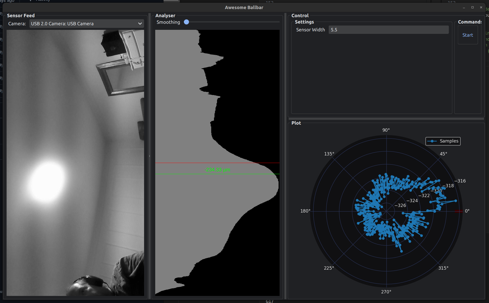

# Awesome Ballbar

## Open-Source Ball Bar Tool for CNC Machine Calibration
The Open-Source Ball Bar Tool is designed to assist in the calibration and precision measurement of CNC machines. By using a DIY ball bar setup, this tool enables accurate detection of machine errors and deviations, helping to ensure optimal performance and accuracy of CNC equipment.

This tool is currently very WIP!

YouTube video:

3d printed files found at: 
